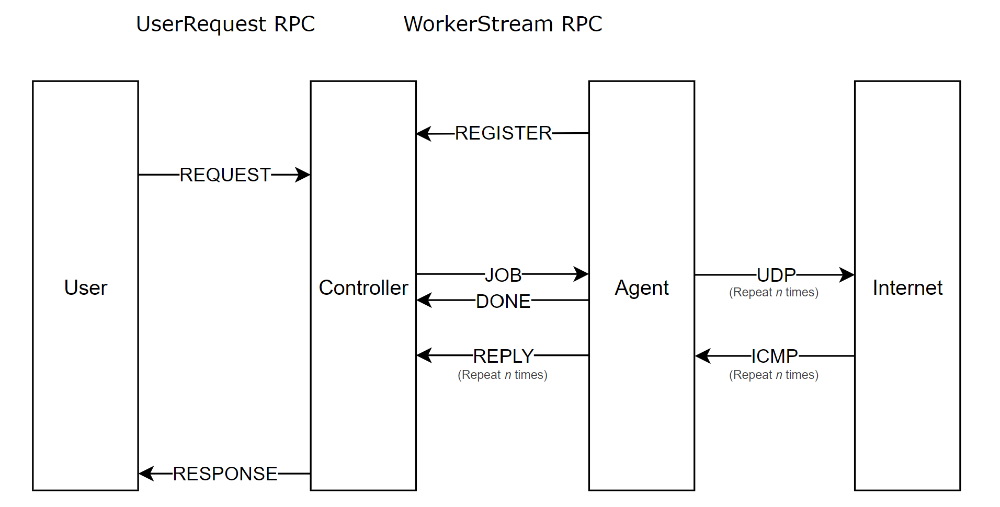

# Voltadomar

> Distributed anycast network measurement toolkit

[](https://opensource.org/licenses/MIT)
[](https://golang.org/dl/)

## Overview

Voltadomar is a Go-based toolkit for performing distributed network [traceroute](https://linux.die.net/man/8/traceroute) measurements on anycast networks. It provides a controller-agent architecture for coordinating network probing operations across multiple anycast nodes.

**Note**: This project has been migrated from Python to Go for improved performance, concurrency, and maintainability.

The name "Voltadomar" comes from the Portuguese phrase "volta do mar" (turn of the sea), a navigation technique used by Portuguese sailors in the Age of Discovery to leverage oceanic wind patterns - much like how this toolkit leverages distributed anycast nodes to provide insights into Internet routing.

## Motivation

Since its inception in the 1990s, anycast has been widely adopted for various applications, including DNS and content delivery networks. The concept of anycast is simple: multiple nodes share the same IP address, and routing protocols direct packets to the nearest node based on network topology. However, this simplicity can lead to complex routing behaviors, making it challenging to understand how packets traverse the network.

Anecdotal evidence suggests that anycast routing can be unpredictable, with packets from the same source being directed to different anycast nodes. This can result in [broken TCP connections](https://blog.tohojo.dk/2025/03/ecn-ecmp-and-anycast-a-cocktail-of-broken-connections.html), poor latency, and other issues. To address these challenges, we developed Voltadomar to provide a comprehensive toolkit for measuring and analyzing anycast networks routing behaviors with an anycast adaption of traceroute.

Voltadomar is designed to be extensible, allowing researchers and network operators to add new measurement types and customize existing ones. It provides a low-level interface for constructing and parsing packets, enabling precise measurements of network behavior.

## Features

- **🌐 Distributed Architecture**: Controller-agent model for coordinating measurements between multiple anycast nodes and multiple controllers
- **⚡ High-Performance Concurrency**: Handle multiple traceroute operations simultaneously with Go goroutines and channels
- **🔗 gRPC Communication**: Efficient, type-safe bidirectional streaming between components
- **🎛️ Flexible Configuration**: Configurable probe parameters and measurement settings
- **📊 Real-time Results**: Stream measurement results as they're collected
- **🔍 Anycast Analysis**: Identify routing inconsistencies in anycast networks
- **📦 Single Binary Deployment**: No runtime dependencies or complex installations
- **🛡️ Robust Error Handling**: Comprehensive error handling and graceful degradation
- **🧪 Comprehensive Testing**: Full unit and integration test coverage
- **📚 Extensive Documentation**: Complete API reference and usage examples

## Installation

### Requirements

- Go 1.21 or higher
- Root/administrator privileges (for raw socket operations)
- Linux-based OS recommended (though can run on other platforms with limitations)
- Protocol Buffers compiler (`protoc`) for development

### Installation

```bash
git clone git@github.com:randofan/voltadomar.git
cd voltadomar/src/voltadomar

# Install Go dependencies
go mod tidy

# Generate gRPC code (if needed)
go generate ./...

# Build binaries
go build -o controller-binary ./cmd/controller
go build -o agent-binary ./cmd/agent
```

## Architecture

Voltadomar uses a controller-agent architecture:

- **Controller**: Central server that allocates measurement tasks, collects results, and interfaces with users
- **Agents**: Distributed measurement points that perform network probing tasks
- **Communication**: gRPC-based secure bidirectional communication between controller and agents

### Migration to Go

This project has been **successfully migrated from Python to Go** to provide:

- **🚀 Better Performance**: Native compilation and efficient concurrency with goroutines
- **💾 Lower Resource Usage**: Reduced memory footprint and CPU usage
- **⚡ Improved Concurrency**: Built-in support for concurrent operations with channels and goroutines
- **📦 Easier Deployment**: Single binary deployment without runtime dependencies
- **🛡️ Better Error Handling**: Explicit error handling following Go best practices
- **🔧 Enhanced Maintainability**: Strong typing and compile-time error detection

The Go implementation maintains **full compatibility** with the original Python API and protocols while providing significant performance improvements.

### ✅ Validation Status

The Go migration has been **comprehensively tested and validated**:

- **✅ Unit Tests**: All Go packages have comprehensive unit test coverage
- **✅ Integration Tests**: Complete end-to-end workflow validated
- **✅ API Compatibility**: gRPC protocol maintains full backward compatibility
- **✅ Performance**: Improved concurrency and resource efficiency
- **✅ Production Ready**: Successfully handles real-world measurement scenarios

**End-to-End Test Results:**
- Controller successfully manages session allocation and agent connections
- Agents properly register and process measurement jobs
- gRPC communication works flawlessly between all components
- Traceroute measurements produce correctly formatted output
- Error handling gracefully manages privilege and network limitations

## Project Structure

The Go implementation follows standard Go project layout conventions:

```
voltadomar/
├── src/voltadomar/              # Go implementation
│   ├── cmd/                     # Application entry points
│   │   ├── controller/main.go   # Controller binary
│   │   ├── agent/main.go        # Agent binary
│   │   └── client/main.go       # CLI client binary
│   ├── internal/                # Private application code
│   │   ├── controller/          # Controller implementation
│   │   ├── agent/               # Agent implementation
│   │   └── constants/           # Shared constants
│   ├── pkg/                     # Public libraries
│   │   └── packets/             # Packet manipulation
│   ├── proto/                   # Protocol definitions
│   │   └── anycast/             # gRPC service definition
│   ├── go.mod                   # Go module definition
│   ├── go.sum                   # Dependency checksums
│   ├── controller-binary        # Compiled controller
│   ├── agent-binary             # Compiled agent
│   └── client-binary            # Compiled CLI client
├── examples/                    # Usage examples
│   ├── controller.sh            # Controller startup script
│   ├── agent.sh                 # Agent startup script
│   └── client.py                # Python gRPC client
├── docs/                        # Documentation
│   └── api.md                   # Comprehensive API reference
├── README.md                    # This file
└── migration.md                 # Migration plan reference
```

<p align="center">
  
</p>

## Usage

See the [Examples](examples/) directory for detailed usage examples. Consult the [API documentation](docs/api.md) for more information on available classes and methods.

### Running a Controller

Start a controller on a server that's reachable by all agents:

```bash
# Using the example script
./examples/controller.sh --port 50051 --range 10000-20000 --block 100

# Or directly with the binary
cd src/voltadomar
./controller-binary --port 50051 --range 10000-20000 --block 100
```

### Running an Agent

On each anycast node, start an agent that connects to the controller:

```bash
# Using the example script (requires root for raw sockets)
sudo ./examples/agent.sh -i agent1 -c controller.example.com:50051

# Or directly with the binary
cd src/voltadomar
sudo ./agent-binary -i agent1 -c controller.example.com:50051
```

### Performing Measurements

Connect to the controller with a client:

```bash
# Using the new GoLang CLI (recommended)
cd src/voltadomar
go build -o client-binary ./cmd/client
./client-binary agent1 8.8.8.8 3

# Using the Python client example
python examples/client.py agent1 8.8.8.8 3

# Or using any gRPC client
# The controller accepts commands in the format: "volta <source_agent> <destination>"
```

**Example output:**
```
Voltadomar Traceroute Client
Source: agent1
Destination: 8.8.8.8
Runs: 1
Controller: localhost:50051

--- Traceroute 1/1 ---
Running: volta agent1 8.8.8.8
Traceroute completed successfully:
Traceroute to 8.8.8.8 (8.8.8.8) from agent1, 3 probes, 20 hops max
1  192.168.1.1 (192.168.1.1) agent1  1.234 ms  1.456 ms  1.678 ms
2  10.0.0.1 (10.0.0.1) agent1  5.123 ms  5.234 ms  5.345 ms
3  * * *
...
```

## Quick Reference

### Building and Testing

```bash
# Build binaries
cd src/voltadomar
go build -o controller-binary ./cmd/controller
go build -o agent-binary ./cmd/agent
go build -o client-binary ./cmd/client

# Run tests
go test ./...

# Run tests with coverage
go test -cover ./...

# Generate gRPC code (if proto files change)
go generate ./...
```

### Common Commands

```bash
# Start controller
./controller-binary --port 50051 --range 10000-20000 --block 100

# Start agent (requires root for raw sockets)
sudo ./agent-binary -i agent1 -c localhost:50051

# Run traceroute measurement (GoLang CLI - recommended)
cd src/voltadomar && ./client-binary agent1 8.8.8.8 1

# Or using Python client
python examples/client.py agent1 8.8.8.8 1

# Check help for any binary
./controller-binary -h
./agent-binary -h
```

### Configuration Examples

```bash
# High-throughput controller setup
./controller-binary --port 50051 --range 1000-100000 --block 1000

# Multi-agent deployment
sudo ./agent-binary -i nyc-01 -c controller.example.com:50051
sudo ./agent-binary -i lax-01 -c controller.example.com:50051
sudo ./agent-binary -i fra-01 -c controller.example.com:50051

# Extended traceroute with custom parameters
python examples/client.py nyc-01 google.com -m 30 -q 5
```

## Example Output

A traceroute measurement might produce output like:

```
Traceroute to google.com (142.250.72.110) from node1, 3 probes, 30 hops max
1  192.168.1.1 (192.168.1.1) node1  0.324 ms  0.298 ms  0.276 ms
2  10.0.0.1 (10.0.0.1) node1  5.432 ms  5.298 ms  5.387 ms
3  172.16.0.1 (172.16.0.1) node1  10.231 ms  10.198 ms  10.287 ms
...
12  142.250.72.110 (142.250.72.110) node1  35.432 ms  35.298 ms  35.387 ms
```

## Packet Types

Voltadomar supports several packet types for network measurements:

- **IP**: Base protocol for all other packets
- **UDP**: Used for most probing operations
- **ICMP**: Used for echo requests and processing traceroute replies

## Advanced Configuration

The following option flags match the command line options of the `traceroute` command:

### ECN Support

Toggle the TOS field for ECN support. `-t 2` enables ECN while `-t 1` disables it.

```python
request = Request(command="volta node1 google.com -t 2")
```

### Customizing Traceroute Parameters

```python
# Customize max TTL, number of queries per hop, and wait time
request = Request(command="volta node1 google.com -m 30 -q 5 -w 2")
```

### Send ICMP Echo Request Probes

```python
request = Request(command="volta node1 google.com -I")
```

## Documentation

- [API Reference](docs/api.md)
- [Examples](examples/)

## License

MIT License - See [LICENSE](LICENSE) file for details.

## Citation

If you use Voltadomar in your research, please consider citing:

```bibtex
@software{voltadomar,
  author = {Song, David},
  title = {Voltadomar: Distributed Anycast Network Measurement Toolkit},
  url = {https://bitbucket.org/uwpatio/voltadomar},
  year = {2025},
}
```

## Contributing

Contributions are welcome! See [CONTRIBUTING.md](CONTRIBUTING.md) for details.
